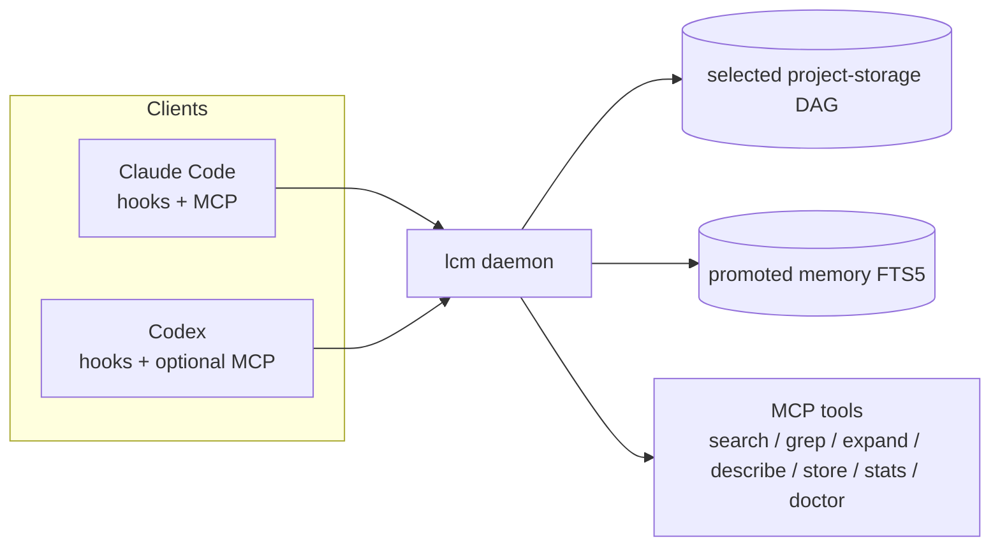
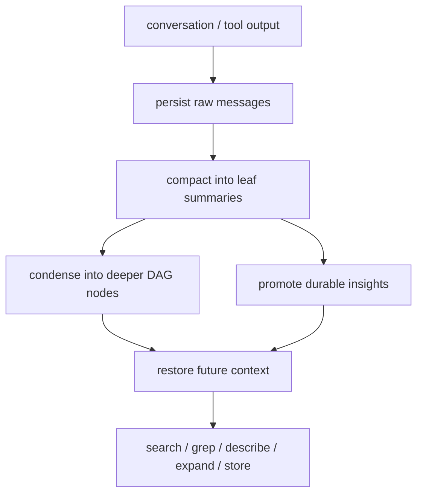
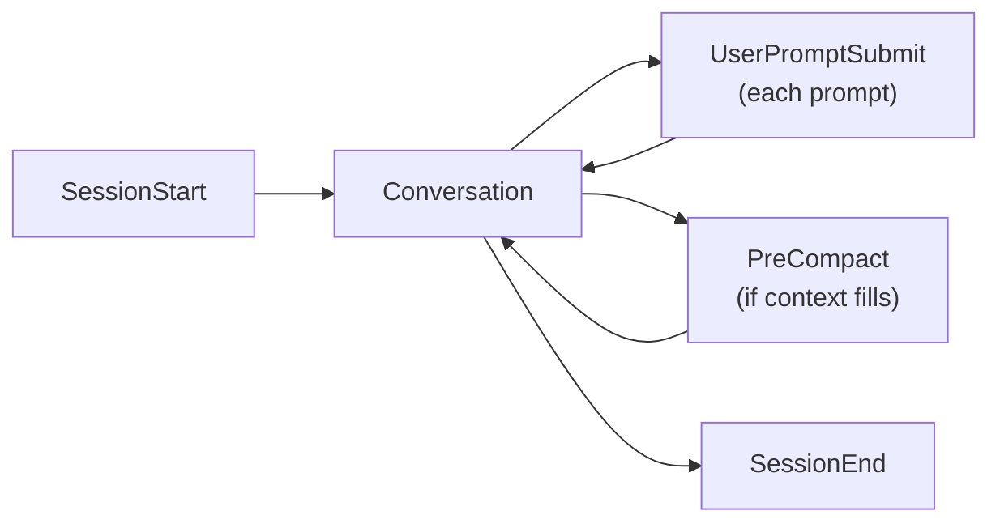

<p align="center">
  <strong>Lossless Context Manager</strong><br>
  Shared memory infrastructure for coding agents
</p>

<p align="center">
  DAG-based summarization, selected-backend message persistence, promoted long-term memory, MCP retrieval tools
</p>

<p align="center">
  <a href="https://www.npmjs.com/package/@donadiosolutions/lcm"></a>
  <a href="LICENSE"></a>
  <a href="https://github.com/donadiosolutions/lcm/actions/workflows/ci.yml"></a>
  <a href="https://socket.dev/npm/package/@donadiosolutions/lcm"></a>
  <a href="https://github.com/donadiosolutions/lcm/actions/workflows/codeql.yml"></a>
  <a href="https://codecov.io/gh/donadiosolutions/lcm"></a>
</p>

<p align="center">
  <a href="https://codecov.io/gh/donadiosolutions/lcm"></a>
</p>

<p align="center">
  <a href="#runtime-model">Runtime Model</a> &bull;
  <a href="#installation">Installation</a> &bull;
  <a href="docs/README.md">Documentation</a> &bull;
  <a href="#mcp-tools">MCP Tools</a> &bull;
  <a href="#development">Development</a>
</p>

---

`Lossless Context Manager` replaces sliding-window forgetfulness with a persistent memory runtime for both humans and agents.

- Every message is stored in the selected project backend; SQLite remains the
  zero-configuration default and PostgreSQL is an explicit remote-primary option.
- Older context is compacted into a DAG of summaries instead of being dropped.
- Durable decisions and findings are promoted into cross-session memory.
- Claude Code and Codex have native hook integrations, while VS Code uses connector-based workflows on the same backend today.

Humans and agents use the same backend. The integration surface differs by client, but the memory model is shared.

## Runtime Model



### Capabilities by integration path

| Path | Restore | Prompt hints | Turn writeback | Automatic compaction | Notes |
|---|---|---|---|---|---|
| Claude Code | Yes | Yes | Yes, via transcript/hooks | Yes | Primary hook-based integration |
| GitHub Copilot (VS Code) | No | Yes, via rules | No | No | Repo-local skill can teach Copilot to call `lcm`, but there is no automatic restore or turn capture yet |
| Codex | Yes | Yes | Yes, via native hooks | Yes, thresholded | `lcm connectors install codex` writes native Codex hooks and the LCM skill for restore, prompt hints, passive learning, rolling transcript snapshots, and thresholded compaction |

## LCM Model

| Phase | What happens |
|---|---|
| Persist | Raw messages are stored in SQLite per conversation |
| Summarize | Older messages are grouped into leaf summaries |
| Condense | Summaries roll up into higher-level DAG nodes |
| Promote | Durable insights are copied into cross-session memory |
| Restore | New sessions recover context from summaries and promoted memory |
| Recall | Agents query, expand, and inspect memory on demand |

Nothing is dropped. Raw messages remain in the database. Summaries point back to their sources. Promoted memory remains searchable across sessions.



## Installation

### Prerequisites

- Node.js 22.12.0 or newer
- For hook based automation, one of:
  - Claude Code (native hooks)
  - Codex CLI/VSCode integration/app (native hooks)
  - VS Code with GitHub Copilot extension (connector-based)

### Claude Code

Install LCM from npm, then configure the native Claude Code integration:

```bash
npm install -g @donadiosolutions/lcm@latest
lcm install
lcm doctor
```

`lcm install` writes the native Claude Code hooks and MCP configuration,
installs slash commands and skills, and verifies the daemon. If it finds a
recognized LCM Marketplace installation from the current or legacy upstream
repository, it removes that installation first to prevent duplicate hooks.
LCM no longer supports direct installation from the Claude Marketplace.

Update LCM through npm and rerun the idempotent installer:

```bash
npm install -g @donadiosolutions/lcm@latest
lcm install
lcm doctor
```

### VS Code (GitHub Copilot)

Install the `lcm` binary first:

```bash
npm install -g @donadiosolutions/lcm
```

Then install the repo-local Copilot connector. It is CLI-only, so the explicit
transport is optional but shown here:

```bash
lcm connectors install github-copilot --transport cli
lcm connectors doctor github-copilot
```

This creates a workspace skill under `.github/skills/lcm-memory/SKILL.md` so
Copilot can search and store memory through the `lcm` CLI.

### Codex

Install the `lcm` binary first:

```bash
npm install -g @donadiosolutions/lcm
```

Then install the Codex connector:

```bash
lcm connectors install codex
lcm connectors doctor codex
```

This installs the default Codex CLI bundle:

- Native hooks in `~/.codex/hooks.json` and Codex's current `hooks` feature in `~/.codex/config.toml`
- The LCM skill in `~/.codex/skills/lcm-memory/SKILL.md`

The default is exactly the native hook plus the `lcm-memory` skill. It does not
add, remove, or inspect MCP configuration on a fresh/default Codex install.

The native hooks use:

| Codex event | LCM command | Purpose |
|---|---|---|
| `SessionStart` | `lcm restore --client codex` | Restore project memory at startup, resume, or clear |
| `UserPromptSubmit` | `lcm user-prompt --client codex` | Inject relevant memory before each prompt |
| `PostToolUse` | `lcm post-tool --client codex` | Capture passive learning signals from tool use |
| `PreCompact` | `lcm session-snapshot --client codex` | Force-ingest transcript deltas before manual or automatic Codex compaction |
| `Stop` | `lcm session-snapshot --client codex` | Ingest Codex transcript deltas and compact when the configured token threshold is reached |

Import older Codex sessions when needed:

```bash
lcm import --codex
lcm import --provider all
```

Codex import defaults to the current canonical project. Add `--all` to consider
all locally verified projects. LCM conservatively reconciles deleted
`~/.codex/worktrees/` sessions from exact thread ownership or a unique local
repository match and reports unresolved or ambiguous sessions without guessing.
On a repository's first LCM command, import registers the current verified Git
identity before indexing Codex history, so sessions started in subdirectories
are included immediately. `lcm export --all` reconciles every metadata-backed
candidate and exports each final canonical project only once.

To explicitly select MCP for Codex, run `lcm connectors install codex --transport mcp`.
The installer manages Codex MCP through native `codex mcp` commands; no TOML
editing is required. Switch back with
`lcm connectors install codex --transport cli`.

### Connector transports

Install one complete bundle per agent:

```bash
lcm connectors install <agent> [--transport cli|mcp] [--global]
lcm connectors remove <agent> [--global]
```

An explicit `--transport` wins over the stored
`connectors.transports.<agent-id>` choice, which wins over the registry
default. Implicit defaults are not persisted. MCP is the default only for
Claude Code, Qwen Code, and Zed; Codex and every other agent default to CLI.
Cline and Augment are CLI-only until verifiable MCP adapters exist. Transport
guidance is pure to the selected transport: there is no fallback between MCP
and CLI tool instructions. Removal deletes the whole LCM-owned bundle.

See [`docs/vscode-codex.md`](docs/vscode-codex.md) for the current VS Code/Codex setup path and remaining limitations.

## Hooks

Claude Code uses npm-managed native hooks in `~/.claude/settings.json`. All
Claude Code hooks auto-heal: each validates that all required entries remain
registered and repairs missing entries before continuing. Codex uses native
hooks from `~/.codex/hooks.json`.

| Hook | Command | Purpose |
|---|---|---|
| `PreCompact` | `lcm compact --hook` | Intercepts compaction and writes DAG summaries |
| `SessionStart` | `lcm restore` | Restores project context, recent summaries, and promoted memory |
| `UserPromptSubmit` | `lcm user-prompt` | Searches memory and injects prompt-time hints |
| `PostToolUse` | `lcm post-tool` | Captures passive-learning signals from tool use |
| `Stop` | `lcm session-snapshot` | Ingests transcript deltas during the session |
| `SessionEnd` | `lcm session-end` | Ingests the completed Claude transcript |



## MCP Tools

| Tool | Purpose |
|---|---|
| `lcm_search` | Hybrid search across episodic memory (SQLite) and semantic memory |
| `lcm_grep` | Regex or full-text search across raw messages and summaries |
| `lcm_expand` | Decompress a summary node into its source content by traversing the DAG |
| `lcm_describe` | Inspect metadata and lineage of a memory node (depth, token count, parent/child links) |
| `lcm_store` | Persist durable memory manually with optional tags |
| `lcm_stats` | Show token savings, compression ratios, and usage statistics |
| `lcm_doctor` | Diagnose daemon, hooks, MCP registration, and summarizer setup |

## CLI

See [Command-line behavior](docs/cli.md) for custom and nested help behavior
and unknown-command handling.

```bash
# Setup & diagnostics
lcm install                # setup wizard
lcm uninstall              # remove hooks, MCP, and config
lcm doctor                 # diagnostics: daemon, hooks, MCP, summarizer
lcm diagnose               # scan recent sessions for hook failures
lcm status                 # daemon + summarizer mode
lcm -V                     # version

# Memory inspection
lcm search "query"        # search episodic and promoted memory
lcm grep "pattern"        # search messages and summaries
lcm describe <nodeId>      # inspect metadata for a memory node
lcm expand <nodeId>        # expand a summary node into source detail
lcm store "content"       # persist a durable memory entry
lcm stats                  # memory and compression overview
lcm stats -v               # per-conversation breakdown
lcm stats --pool           # connection pool statistics

# Machine and project identity
lcm machine register --name workstation # register this machine for PostgreSQL
lcm machine show --json                  # show the local machine UUID
lcm machine recover <machine-uuid>       # recover after a reimage
lcm project create [path] --name lcm     # create and bind a PostgreSQL project
lcm project link <project-uuid> [path]   # pair a path to a remote project
lcm project link <local-hash> <alias>    # add a same-machine path alias
lcm project unlink [path]                # remove an alias or remote binding
lcm project list --json                  # list local and remote identities
lcm project show [path|local-hash|project-uuid] # inspect one uniquely mapped project

# Compaction & promotion
lcm compact                # compact the current project
lcm compact --all          # compact all tracked projects
lcm compact --reasoning-effort high  # one-run OpenAI Responses reasoning override
lcm compact --timeout-ms 120000 --retry-max-attempts 4  # one-run request-policy overrides
lcm promote                # promote durable insights to long-term memory
lcm promote --all          # promote across all tracked projects

# Configuration
lcm config get llm.provider             # show the normalized stored value
lcm config get llm.model --effective    # include defaults and environment overrides
lcm config set llm.model gpt-5-mini        # store a string value
lcm config set hooks.disableAutoCompact true --json  # store a typed JSON value

# Import / export
lcm import                 # import Claude Code sessions for the current project
lcm import --all           # import all projects
lcm import --codex         # import Codex CLI sessions
lcm import --provider all  # import Claude Code and Codex CLI sessions
lcm export                 # export promoted knowledge to JSON
lcm import-knowledge <f>   # import a knowledge JSON file

# Connectors (wire lcm into other AI agents)
lcm connectors list        # list available agents and installed connectors
lcm connectors install <agent> [--transport cli|mcp] [--global] # install one bundle
lcm connectors remove <agent> [--global]                      # remove the whole bundle
lcm connectors doctor      # check connector health

# Sensitive data
lcm sensitive add <pat>    # add a redaction pattern (project-scoped)
lcm sensitive add --global # add a global redaction pattern
lcm sensitive list         # list all active patterns
lcm sensitive test <str>   # test what gets redacted
lcm sensitive purge --yes  # remove all stored data for the current project

# Daemon
lcm daemon start           # start managed daemon in background
lcm daemon restart         # validate config, restart daemon, and apply changes
# If the daemon is unavailable, run `lcm doctor` and then `lcm daemon restart`.

# Hook handlers (internal — called by Claude Code hooks)
lcm compact --hook         # PreCompact hook
lcm restore                # SessionStart hook
lcm session-end            # SessionEnd hook
lcm user-prompt            # UserPromptSubmit hook
lcm post-tool              # PostToolUse hook (passive learning)

# MCP server
lcm mcp                    # start MCP server
```

Daemon recovery is service-manager based. Linux uses the current user's
`systemd --user` manager and macOS uses the current user's `launchd` agent;
neither is configured with automatic restart or `KeepAlive`. A normal idle
exit is recreated on the next LCM request, while an uncertain or unsupported
process is left untouched. Run `lcm doctor` for diagnostics and
`lcm daemon restart` for a validated replacement. Detached/foreground launches,
Windows, and containers without a user service manager are not offline recovery
authorities. If a client connector is stale after an update, reinstall it with
`lcm connectors install <agent>` and run its connector doctor before retrying.
There is no detached offline force-recovery option, and service-manager
ownership is not a same-UID filesystem security boundary.

See [Machine registration and project identity](docs/project-identity.md) for
linked-worktree consolidation, historical Codex reconciliation, PostgreSQL
pairing, reimage recovery, local aliases, permissions, unlink/relink behavior,
migration binding, and ambiguity diagnosis.
Remote UUID show targets resolve through that local project map: exactly one
local entry must bind the UUID. Unknown or multiply mapped UUIDs are rejected;
use `lcm project list --json` and select a local path or hash to diagnose them.

## Configuration

All environment variables are optional. The default summarizer mode is `auto`.

| Variable | Default | Description |
|---|---|---|
| `LCM_SUMMARY_PROVIDER` | `auto` | `auto`, `claude-process` (`claude`/`claude-cli` aliases), `codex-process` (`codex` alias), `anthropic`, `openai` (`custom`/`openai-compatible` aliases), or `disabled` |
| `LCM_SUMMARY_MODEL` | unset | Optional model override for the selected summarizer provider |
| `LCM_CONTEXT_THRESHOLD` | `0.75` | Context fill ratio that triggers compaction |
| `LCM_FRESH_TAIL_COUNT` | `32` | Most recent raw messages protected from compaction |
| `LCM_LEAF_MIN_FANOUT` | `8` | Minimum raw messages per leaf summary |
| `LCM_CONDENSED_MIN_FANOUT` | `4` | Minimum summaries per condensed node |
| `LCM_INCREMENTAL_MAX_DEPTH` | `0` | Automatic condensation depth |
| `LCM_LEAF_CHUNK_TOKENS` | `20000` | Maximum source tokens per leaf compaction pass |
| `LCM_LEAF_TARGET_TOKENS` | `1200` | Target size for leaf summaries |
| `LCM_CONDENSED_TARGET_TOKENS` | `2000` | Target size for condensed summaries |
| `LCM_MAX_EXPAND_TOKENS` | `4000` | Token cap for DAG expansion via `lcm_expand` |
| `LCM_LARGE_FILE_TOKEN_THRESHOLD` | `25000` | File size (tokens) above which content is extracted to disk |
| `LCM_AUTOCOMPACT_DISABLED` | `false` | Set to `true` to disable automatic compaction after each turn |
| `LCM_ENABLED` | `true` | Set to `false` to disable LCM while keeping its native integration installed |

`auto` resolves per caller:

- `lcm` -> `claude-process`
- explicit config or `LCM_SUMMARY_PROVIDER` override always takes precedence

`LCM_SUMMARY_MODEL` overrides `llm.model` after JSON and runtime configuration
are merged. An explicitly empty environment value is still an override and
fails validation when the selected remote provider requires a model.

OpenAI defaults to Chat Completions. `llm.baseUrl` is the canonical endpoint key;
legacy `llm.baseURL` remains readable for migration, but conflicting values are
rejected. OpenAI requests default to a 600000 ms timeout and three total attempts
with bounded exponential backoff. To opt into the Responses API and reasoning,
set `llm.apiMode` to `responses` and `llm.reasoningEffort` to `none`, `minimal`,
`low`, `medium`, `high`, or `xhigh` in `~/.lcm/config.json`. A
`--reasoning-effort` CLI value overrides JSON for one `lcm compact` invocation
without rewriting the file. Process summarizers accept their provider-native
reasoning levels: Claude accepts `low`, `medium`, `high`, `xhigh`, and `max`;
Codex accepts `minimal`, `low`, `medium`, `high`, and `xhigh`. Set
`llm.fastMode` (default `false`), or use `--fast-mode`/`--no-fast-mode` for one
compaction, to control process-provider priority processing. LCM passes these
controls to the provider CLI, whose installed version and selected model remain
authoritative, and reports failures without exposing prompts, provider bodies,
credential-bearing URLs, or credentials.

See [`docs/configuration.md`](docs/configuration.md) for the complete JSON example,
provider requirements, and deeper operational guidance.

## Storage backend

SQLite remains the zero-configuration storage backend. LCM also validates the
configuration and verified-TLS prerequisites for an explicit remote-primary
PostgreSQL selection and includes an internal PostgreSQL 18 pool, migration
runner, schema baseline, project-storage factory, and isolated conformance
harness. The daemon and MCP project routes use that verified factory when the
published selection is PostgreSQL. They open a project-scoped `ProjectStorage`
containing conversation, summary, context, large-file, promoted-memory,
recall, redaction-administration, lexical-search, and coordination repositories
behind one transaction and lifecycle boundary. Factory creation eagerly
verifies runtime health, PostgreSQL 18, extensions, migration history, schema
fingerprints, ownership, search configuration, and the exact least-privilege
ACL manifest. Opening a project then requires valid backend-publication
evidence and an exact remote machine/project/path identity match before
exposing any repository. A PostgreSQL route never falls back to project
SQLite; hooks retain their intentional local SQLite outbox.

Embedded ESM callers import the curated production seam without exposing
internal runtime, migration, or testing helpers:

```ts
import {
  createPostgreSqlStorageBackendFactory,
  type PostgreSqlStorageBackendFactory,
  type ProjectStorage,
  type ResolvedPostgreSqlConfig,
  type StorageIdentityContext,
} from "@donadiosolutions/lcm/storage/postgresql";

type EstablishedPostgreSqlIdentity = StorageIdentityContext & {
  readonly localProjectId: string;
  readonly machineId: string;
  readonly remoteProjectId: string;
  readonly selectedPath: string;
};

export async function usePostgreSqlProject(
  config: ResolvedPostgreSqlConfig,
  identity: EstablishedPostgreSqlIdentity,
): Promise<void> {
  let factory: PostgreSqlStorageBackendFactory | undefined;
  let project: ProjectStorage | undefined;
  let operationFailed = false;
  try {
    factory = await createPostgreSqlStorageBackendFactory(config);
    project = await factory.openProject(identity);
    const health = await project.health();
    if (health.status !== "healthy") {
      throw health.error ?? new Error("PostgreSQL project storage is not healthy");
    }
    // Use project repositories or project.transaction(...) here.
  } catch (error) {
    operationFailed = true;
    throw error;
  } finally {
    let cleanupFailed = false;
    let cleanupFailure: unknown;
    try {
      await project?.close();
    } catch (error) {
      cleanupFailed = true;
      cleanupFailure = error;
    }
    try {
      await factory?.close();
    } catch (error) {
      if (!cleanupFailed) cleanupFailure = error;
      cleanupFailed = true;
    }
    if (!operationFailed && cleanupFailed) {
      throw cleanupFailure;
    }
  }
}
```

The caller must receive that complete context from authenticated, already
established LCM identity state; the curated subpath does not discover, create,
link, or repair identities. `id` and `remoteProjectId` are the same lowercase
UUIDv7 established by `lcm project create` or `lcm project link`.
`localProjectId` and `canonical` come from the established local project-map
identity for the selected checkout, and `machineId` comes from the registered
local machine identity. `selectedPath` is the exact lexical absolute path
chosen by the cwd-aware create/link boundary—for example,
`resolve(projectPath)`—not a substituted canonical path or shared-worktree
anchor. Do not synthesize the context from unauthenticated file reads. Missing,
invalid, or mismatched identity fields fail closed. Migration witness hashes
are integrity evidence, not identity or runtime-authorization principals.

The second `openProject` argument is optional. The ordinary curated call above
omits it, so the factory internally captures two short authenticated
backend-publication witness snapshots around the remote PostgreSQL identity
work and requires them to agree. Only code already executing inside the owning
internal coordination boundary with a live `BackendPublicationLockToken` may
pass that token and must keep it active for the entire call. The curated
subpath exports neither the token type nor a token constructor. Do not forge a
token, read raw journal data as authority, or bypass publication evidence; see
the [backend publication safety guide](docs/backend-publication.md).

Closing `ProjectStorage` aborts and settles only that project's tracked work.
Closing the factory aborts and drains pending opens, closes any projects still
registered with it, and closes the shared PostgreSQL runtime. Close the project
first and the factory second in `finally`, as above; this unregisters the
project before factory shutdown while preserving any primary operation failure.

Daemon project routes fail closed with sanitized `409` identity responses or
`503` storage responses when identity, publication, TLS, grants, or runtime
availability are missing. Request cancellation and daemon shutdown close and
drain selected project storage. Connection credentials stay out of JSON and
effective configuration output. Configure the non-secret expected
migration-owner role, provision the schema as that owner with `lcm postgres
migrate`, then apply the reviewed
[readiness](src/storage/postgresql/reference/postgresql-runtime-readiness-grants.sql),
[identity](src/storage/postgresql/reference/postgresql-runtime-identity-grants.sql),
[conversation](src/storage/postgresql/reference/postgresql-runtime-conversation-grants.sql),
[summary/context](src/storage/postgresql/reference/postgresql-runtime-summary-context-grants.sql),
[memory and administration](src/storage/postgresql/reference/postgresql-runtime-memory-grants.sql),
[lexical-search](src/storage/postgresql/reference/postgresql-runtime-search-grants.sql), and
[coordination](src/storage/postgresql/reference/postgresql-runtime-coordination-grants.sql)
runtime grants. Apply the separate
[native-transcript](src/storage/postgresql/reference/postgresql-runtime-transcript-grants.sql)
grants only when the explicit transcript repository is used. Each script
grants only its reviewed relation, column, sequence, schema, and function
privileges; the readiness verifier rejects missing, overbroad, or foreign-grantor
ACLs before domain work.
See
[storage backend configuration](docs/configuration.md#storage-backend)
for operators, the [PostgreSQL schema reference](src/storage/postgresql/reference/postgresql-schema.md) for
the 23-table data and namespace-aware extension contract, and the
[storage repository architecture](docs/architecture.md#storage-repository-architecture)
for repository ownership, lifetimes, transactions, and the local-outbox boundary.
The [native-transcript guide](src/storage/postgresql/reference/postgresql-native-transcripts.md) defines
sanitized “raw” records, provenance, checkpoints, quarantine, and rollback.
The [PostgreSQL memory and administration guide](src/storage/postgresql/reference/postgresql-memory-administration.md)
defines metadata, tag, recall, counter, coordination, and scoped-purge
semantics.
The [PostgreSQL cross-machine coordination guide](src/storage/postgresql/reference/postgresql-coordination.md)
defines transaction-lock, fenced-lease, final-write fence, queue-claim,
delivery, acknowledgement, replay, quarantine, cleanup, diagnostic, and
crash-recovery semantics.
The [PostgreSQL summary, context, and large-file guide](src/storage/postgresql/reference/postgresql-summary-context.md)
defines graph, coverage, context-range, ordering, lock/fence, grant, query-plan,
diagnostic, and recovery semantics.

Issue #617 activates daemon and MCP project-storage routing. CLI/import-export
and portable transfer remain #618-owned; aggregate stats, pool diagnostics,
status, and doctor parity remain #619-owned. Those limitations do not weaken
the daemon's publication, identity, cancellation, shutdown, or privacy gates.

## Development

```bash
npm install
npm run build
npx vitest
npx tsc --noEmit
npm run test:postgresql
```

The PostgreSQL command owns an exact PostgreSQL 18 container and all temporary
TLS, network, volume, credential, and database resources. See
[PostgreSQL development](src/storage/postgresql/reference/postgresql-development.md) before changing its
image digest, migrations, runtime, or cleanup guards.

### Repository layout

```text
bin/
  lcm.ts                      CLI entry point (binary: lcm)
src/
  compaction.ts               DAG compaction engine
  connectors/                 client integration adapters
  daemon/                     HTTP daemon, lifecycle, config, routes
  db/                         SQLite schema + promoted memory
  hooks/                      Claude hook handlers + auto-heal
  llm/                        summarizer backends
  mcp/                        MCP server + tool definitions
  store/                      conversation and summary persistence
  storage/                    backend selection and repository architecture
installer/
  install.ts                  setup wizard
  uninstall.ts                cleanup
test/
  ...                         Vitest suites
```

## Privacy

All conversation data is stored locally in `~/.lcm/`. On Linux with usable `/proc/self/fd` descriptor access, the first startup after upgrading from older releases automatically migrates an existing legacy runtime directory to `~/.lcm/` when the new directory is absent. On macOS, the same legacy state causes a safe refusal before legacy bytes are hashed or copied and before a migration journal is written. Back up and rename—do not recursively delete—`~/.lossless-claude` out of the migration path, confirm the refusal did not create `~/.lcm`, and then rerun the intended command or installation. See [macOS pre-journal recovery](docs/backend-publication.md#recovering-from-a-macos-pre-journal-refusal). Nothing is sent to any LCM server.

After a successful Linux migration, filesystem-race safety requires retaining the legacy directory, an authenticated copy at the unpredictable staging name recorded in `~/.lcm-legacy-migration.json`, and that journal after publication. A terminal `retained` journal does not freeze or rehash live `~/.lcm/` contents on later startups. This retained-evidence state is different from the macOS pre-journal refusal. To reclaim retained evidence after a successful migration, stop LCM, verify that the journal phase is `retained`, remove the legacy directory and the journal's exact `stagingName` path, and remove `~/.lcm-legacy-migration.json` last. See [Backend publication and operator cleanup](docs/backend-publication.md#cleaning-up-retained-legacy-migration-evidence) for the fail-closed order and platform requirements.

If you configure an external summarizer (`claude-process`, `anthropic`, `openai`, etc.), messages are sent to that provider for summarization — after built-in secret redaction. Long Context Manager (LCM) scrubs common secret patterns (API keys, tokens, passwords) from message content before writing to SQLite and before sending to the summarizer.

Add project-specific patterns with `lcm sensitive add "MY_PATTERN"`. See [docs/privacy.md](docs/privacy.md) for full details.

## Acknowledgments

See [`ACKNOWLEDGMENTS.md`](ACKNOWLEDGMENTS.md) for project lineage and prior
work.

## License

MIT
